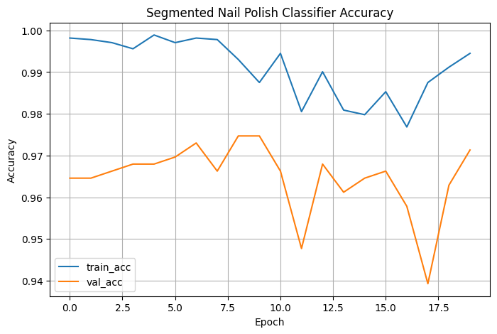
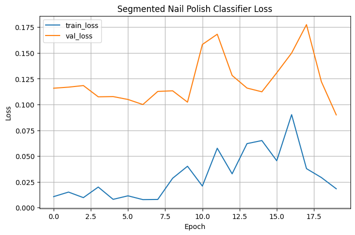

# Nail Polish Condition Classifier for Robust Anemia Imaging

A computer-vision proof of concept that treats nail polish as an **input-condition warning signal** for future fingernail-based anemia-prediction systems.

The project began with a practical robustness problem: nail images containing polish, obstruction, pathology, or other visual interference are often discarded before model training. Inspection of the available excluded data showed that nail polish was the only condition with enough examples for a focused experiment. The final implementation therefore evaluates whether polish can be detected from segmented nail crops before a downstream medical prediction is trusted.

> This repository is a research prototype and does not diagnose anemia or provide clinical advice.

## Project contribution

The implemented pipeline:

1. Separates usable and excluded nail images.
2. Organizes excluded images by recorded reason.
3. Uses polygon annotations to isolate nail regions and remove annotated free edges.
4. Constructs a binary `no_polish` / `polish` crop dataset.
5. Splits data by source-image group to prevent crops from the same image appearing across train, validation, and test sets.
6. Fine-tunes a pretrained ResNet18 classifier.
7. Applies the saved checkpoint to newly annotated test images and aggregates crop-level predictions by image group.

The main engineering emphasis is not anemia classification itself, but **condition-aware input screening**: detecting whether a visual factor may invalidate the color information used by a later anemia model.

## Final recorded results

The final training notebook reports:

| Item | Recorded value |
|---|---:|
| Total segmented crops | 3,910 |
| No-polish crops | 3,508 |
| Polish crops | 402 |
| Source-image groups | 942 |
| Training samples | 2,722 |
| Validation samples | 593 |
| Test samples | 595 |
| Best validation accuracy | 97.47% |
| Test accuracy | 98.66% |
| Polish precision | 0.97 |
| Polish recall | 0.90 |
| Polish F1-score | 0.93 |
| Macro F1-score | 0.96 |

Final confusion matrix:

```text
[[531,   2],
 [  6,  56]]
```

The test split is imbalanced, so the minority-class polish recall and macro F1-score are more informative than accuracy alone. Six polish crops were classified as no-polish, which remains an important failure mode for any future safety gate.

## Training behavior





The training notebook uses:

- A pretrained ResNet18 backbone.
- Group-aware 70/15/15 train-validation-test splitting with seed 42.
- Image resizing, horizontal flips, rotation, and color jitter for training augmentation.
- Class-weighted cross-entropy to address the smaller polish class.
- Trainable `layer3`, `layer4`, and final fully connected layer while earlier layers remain frozen.
- Adam optimization with weight decay and cosine-annealing learning-rate scheduling over 20 epochs.

## Repository structure

```text
.
├── README.md
├── assets/
│   ├── training-accuracy.png
│   └── training-loss.png
├── docs/
│   ├── final-report.pdf
│   ├── final-presentation-slides.pdf
│   └── reproducibility.md
└── notebooks/
    ├── extract_from raw_png.ipynb
    ├── excluded_class.ipynb
    ├── clean_usable_mask.ipynb
    ├── polish_mask.ipynb
    ├── 03-2_train_polish_binary_classifier.ipynb
    ├── my_test.ipynb
    └── best_segmented_polish_classifier_group_split_v2.pth
```

## Notebook guide

| Notebook | Role in the original workflow |
|---|---|
| `extract_from raw_png.ipynb` | Compares a usable-reference directory with a mixed image directory, then exports usable and excluded PNG groups. |
| `excluded_class.ipynb` | Reads exclusion reasons from CSV and organizes excluded images into polish, obstruction, pathology, anomaly-review, and unknown-review folders. |
| `clean_usable_mask.ipynb` | Uses polygon annotations to create nail-only crops from usable images. |
| `polish_mask.ipynb` | Creates nail-only crops from annotated polish images. |
| `03-2_train_polish_binary_classifier.ipynb` | Builds the group-aware split, fine-tunes ResNet18, saves the best checkpoint, and evaluates the test set. |
| `my_test.ipynb` | Crops annotated test nails, runs checkpoint inference, and aggregates predictions by source-image group. |

## Running the notebooks

Install the listed dependencies in a Python environment:

```bash
python -m venv .venv
source .venv/bin/activate
pip install -r requirements.txt
jupyter notebook
```

The dataset is not distributed with this repository. The original notebooks also contain absolute local paths and are preserved unchanged, so those path constants must be adjusted in a local copy before rerunning the pipeline. See [`docs/reproducibility.md`](docs/reproducibility.md) for the expected sequence and recorded dataset counts.


## Scope and limitations

- The classifier recognizes only nail polish versus no polish; it does not reliably cover obstruction, pathology, blur, or other image-quality problems.
- The dataset is substantially imbalanced toward no-polish crops.
- Multiple crops can originate from one source image; group-aware splitting reduces cross-split leakage but does not establish clinical generalization.
- The project evaluates a condition detector, not hemoglobin concentration or anemia status.
- Performance should be validated on a larger external dataset before the model is used as part of a medical pipeline.

## Project history

The included presentation reports an earlier 90.2% experiment. The later final report and final training notebook record the 98.66% full-distribution test result summarized above. Both are retained to show the development of the project rather than replacing the earlier artifact.


